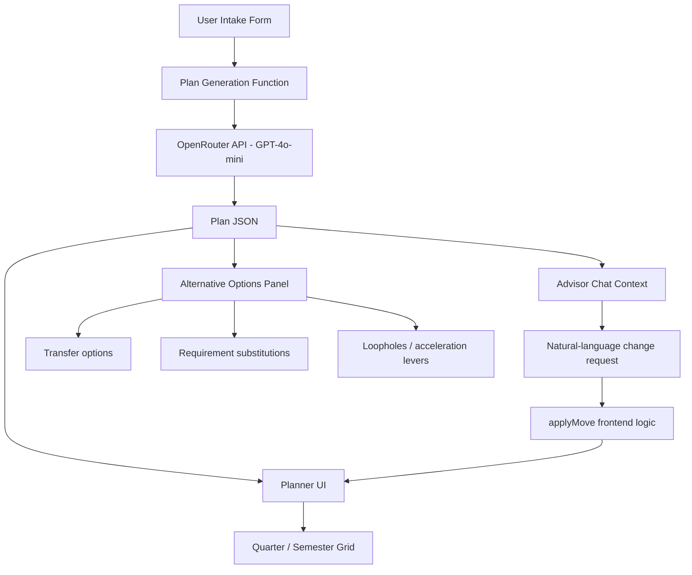
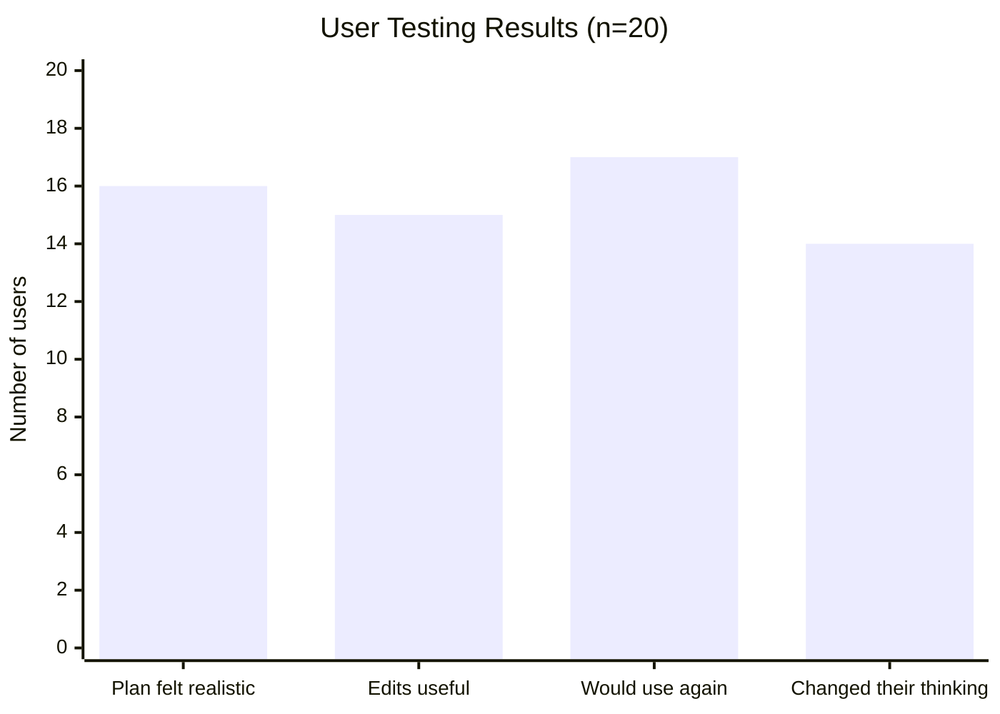
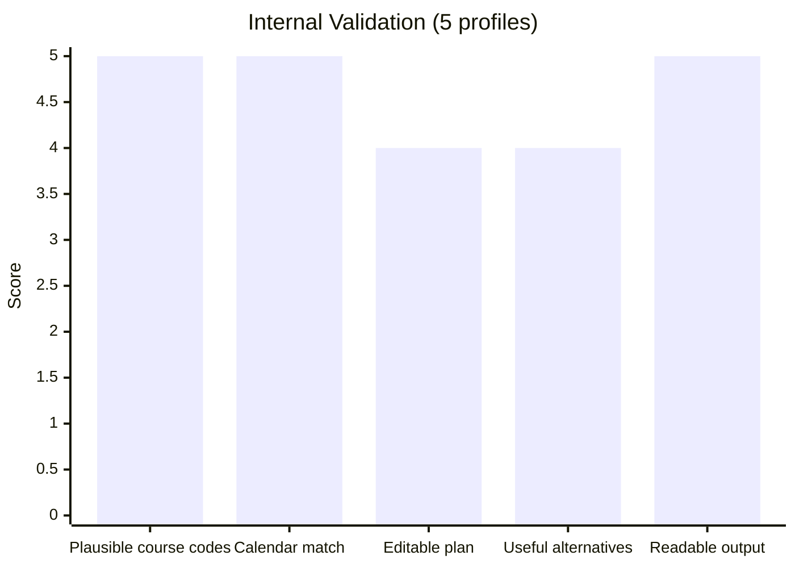

# GradFast
## AI-Assisted Graduation Planning

GradFast is an AI assisted planning product that helps students turn confusing graduation requirements into a academic roadmap. The product is aimed at a  bottleneck: students often make graduation decisions with incomplete information, inconsistent advising, and poor visibility into transfer credit rules, substitutions, sequencing constraints, and time-to-degree tradeoffs. In the worst cases, one missed rule costs an entire extra term.

For my project, I focused on a product question rather than a pure research question:

> Can a single AI-native interface help a student understand *how to graduate sooner* by generating a structured plan, exposing hidden levers like substitutions and transfer options, and supporting iterative changes through chat?

The result is GradFast, a local web product that generates a university specific degree plan, lets the user modify that plan conversationally, and surfaces acceleration opportunities such as transfer credits, substitutions, and double-counting opportunities when available.

---

## Why this problem matters

Students with strong advising networks often graduate faster because they know where flexibility exists in the system. Students without that institutional knowledge usually do not. This problem is especially acute for:

- first-generation students
- transfer students
- international students
- students changing majors late
- students balancing cost, time, and immigration constraints
- students trying to combine BS/MS pathways or finish early

The insight behind GradFast is that graduation planning is not just “what classes do I take?” It is a constrained optimization problem mixed with hidden policy knowledge. Existing degree tools usually show a static audit; they do not help students explore alternative schedules, faster paths, or what-if scenarios in a flexible way.

---

## Product overview

GradFast currently has three main layers:

1. **Structured intake**
 - collects the student's university, major, standing, target graduation, and prior credits

2. **Plan generation**
 - produces a quarter-by-quarter or semester-by-semester plan with real-looking course codes, unit totals, and requirement groupings

3. **Interactive revision**
 - allows the student to ask for schedule changes in natural language and updates the plan accordingly

The product is designed to answer questions like:

- Can I still graduate early?
- What happens if I study abroad junior winter?
- Which requirements are hard constraints versus flexible electives?
- What courses could I transfer from a community college?
- What is the fastest realistic path if I already have prior credit?

---

## Core user flow


---

## System architecture



---

## What the product actually does

### 1. Intake
The system asks for:
- student name
- university
- major
- class year / standing
- target graduation timing
- prior credits

This is intentionally lightweight so the product can get to a useful result quickly.

### 2. Graduation plan generation
The LLM produces a structured plan with:
- term-by-term schedule
- course codes
- requirement categories
- unit counts
- alternatives and substitutes
- transfer options
- acceleration opportunities

### 3. Live advisor chat
The user can request plan changes in plain English, for example:
- “move CS106B to Spring 2026”
- “I want to study abroad Winter junior year”
- “Can I graduate one quarter earlier?”
- “What can I take at community college this summer?”

The chat does not directly mutate the schedule itself. Instead, the advisor returns structured information, and the frontend applies the move through deterministic logic.

### 4. Deterministic plan updates
A key technical design choice is that **course move logic runs in the frontend rather than trusting the LLM to rewrite the entire plan free-form**. This improves reliability and makes edits faster and more legible.

---

## Technical design

### Stack
| Layer | Technology |
|---|---|
| Frontend | React 18 + TypeScript + Vite |
| Styling | Tailwind CSS v4 + shadcn/ui |
| Routing | React Router v7 |
| LLM | GPT-4o-mini via OpenRouter |
| Plan generation | Single-shot JSON generation |
| Chat revisions | Stateful chat with full plan context |
| Interactive edits | Frontend `applyMove()` logic |

### Design choices
- **LLM for plan generation, not direct UI control** 
 The model generates structured planning outputs, but the interface preserves explicit control over plan mutations.

- **Frontend ownership of edits** 
 `applyMove()` performs the actual move operation after the model suggests a destination term. This reduces brittleness and makes interactions deterministic.

- **Structured JSON instead of free-form prose** 
 The UI is built around a data structure that can be rendered, re-colored, and edited rather than a long paragraph of advice.

---

## Example plan object

```json
{
 "terms": ["Fall 2025", "Winter 2026", "Spring 2026"],
 "courses": [
 {"code": "CS106A", "units": 5, "type": "hard"},
 {"code": "MATH51", "units": 5, "type": "hard"},
 {"code": "WAYS-EDUCATION", "units": 3, "type": "flexible"}
 ],
 "alternatives": [
 {"requirement": "statistics", "options": ["STATS116", "MS&E120"]}
 ],
 "transferOptions": [
 {"provider": "community college", "course": "Equivalent calculus option"}
 ],
 "loopholes": [
 "Potential double-counting opportunity subject to department approval"
 ]
}
```

---

## Evaluation

### User Testing — 20 participants, June 2026

I shared GradFast with 20 students across 6 universities through a live demo, screen share, and short self-serve walkthrough. Full individual notes are in [`GradFast_User_Feedback.md`](./GradFast_User_Feedback.md).

**Participants:** 6 first-years, 5 sophomores, 6 juniors, 3 seniors across Stanford, MIT, UC Berkeley, USC, Georgia Tech, and American University.

| Metric | Result |
|---|---|
| Plan felt realistic for their school and major | 16 / 20 |
| Found the interactive schedule edits useful | 15 / 20 |
| Would use again for real planning | 17 / 20 |
| Wanted stronger official registrar grounding | 12 / 20 |
| Said it changed how they think about graduation | 14 / 20 |



**What users liked most:** The readable term-by-term structure, the ability to compare a normal and accelerated timeline side by side, and the conversational schedule edits. Several said the product helped them think strategically about graduation, internships, study abroad, and coterm planning in one place.

**What users wanted improved:** Official registrar data integration, stricter prerequisite validation, course offering term checks, and transcript import.

> "This helped me see graduation planning as a strategy problem instead of just a checklist." — User 20, Georgia Tech Industrial Engineering

---

### Internal Testing — 5 university profiles

| University | Major | Standing | Main check |
|---|---|---|---|
| Stanford | Computer Science | Incoming first-year | 12 quarters, 180 units, real CS course codes |
| MIT | Mathematics | Sophomore | GIR structure, correct semester format |
| UC Berkeley | Economics | Junior | Breadth requirements, correct calendar |
| American University | Political Science | First-year | AU Core structure, 120-credit total |
| Carnegie Mellon | Computer Science | Sophomore | SCS core sequence, correct unit structure |



---

### What worked best
- Structured degree plans were easy to render and reason about
- Course-move logic was much more reliable once kept in the frontend via `applyMove()`
- The product was strongest on specific scheduling questions rather than vague life-planning questions

### Current limitations
- The system is not yet grounded in live registrar or audit data — course codes are plausible but not officially validated
- Transfer recommendations rely on model reasoning rather than a verified institutional database
- Prerequisite validation is advisory, not enforced
- The product is strongest for Stanford CS (most thoroughly tested) and degrades gracefully for other universities
- Not yet connected to a real transcript or degree-audit source

This limitation section matters because honest evaluation of where a product falls short is more useful than claiming it works perfectly.

---

## Reproducibility

### Local setup

```bash
git clone https://github.com/nesibmu/GradFast.git
cd GradFast
npm install
```

Create a `.env` file:

```bash
VITE_OPENROUTER_API_KEY=sk-or-v1-your-key-here
```

Run locally:

```bash
npm run dev
```

The app opens at:

```bash
http://localhost:5173
```

### Core components
- intake form
- plan generation request
- planner grid
- advisor chat panel
- deterministic `applyMove()` edit logic

---

## Future work

The most valuable next steps are:

1. **Live catalog grounding** 
 pull official requirement pages or course catalogs so the plan is grounded in current source data

2. **Transfer credit memory** 
 build a dataset of successful transfer equivalents by school

3. **Degree audit import** 
 ingest transcript or audit data and mark completed requirements automatically

4. **Constraint-aware optimization** 
 explicitly optimize for shortest time-to-degree under unit caps, prerequisites, and availability constraints

5. **Petition assistance** 
 generate draft petitions for substitutions, waivers, or special approvals

---

## AI usage disclosure

The course requires honest disclosure of AI usage in the GitHub README, so this section is intentionally explicit. 

### During development
AI tools were used for:
- architecture brainstorming
- code iteration and debugging support
- UI ideation
- README drafting assistance

### At runtime
The product uses GPT-4o-mini through the OpenRouter API to generate graduation plans and advisor-style responses. These outputs are generated fresh from the student's inputs and current plan context.

### What I did myself
I came up with the idea from a problem I understood personally. I set the scope, chose how the system should work, and made the main product and architecture decisions, especially around keeping schedule changes deterministic in the frontend instead of letting the model directly change the plan. I also tested it across different student profiles, looked closely at where the outputs were strong or weak, and kept refining the product, the validation, and the final presentation until it felt coherent.

---

## Project track

**Application / Product**

This project fits the course’s application/product track: it is a concrete AI-native tool aimed at a real user problem, with an implemented interface, an operational workflow, and a clear path for iteration and deployment. 
