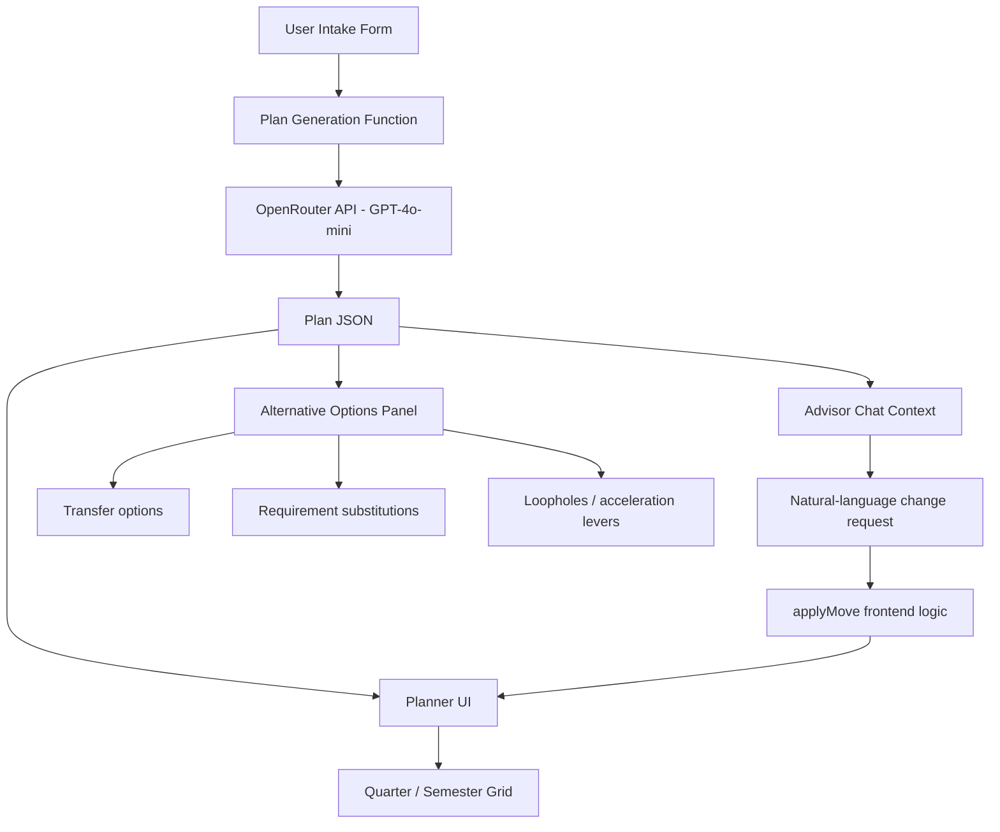
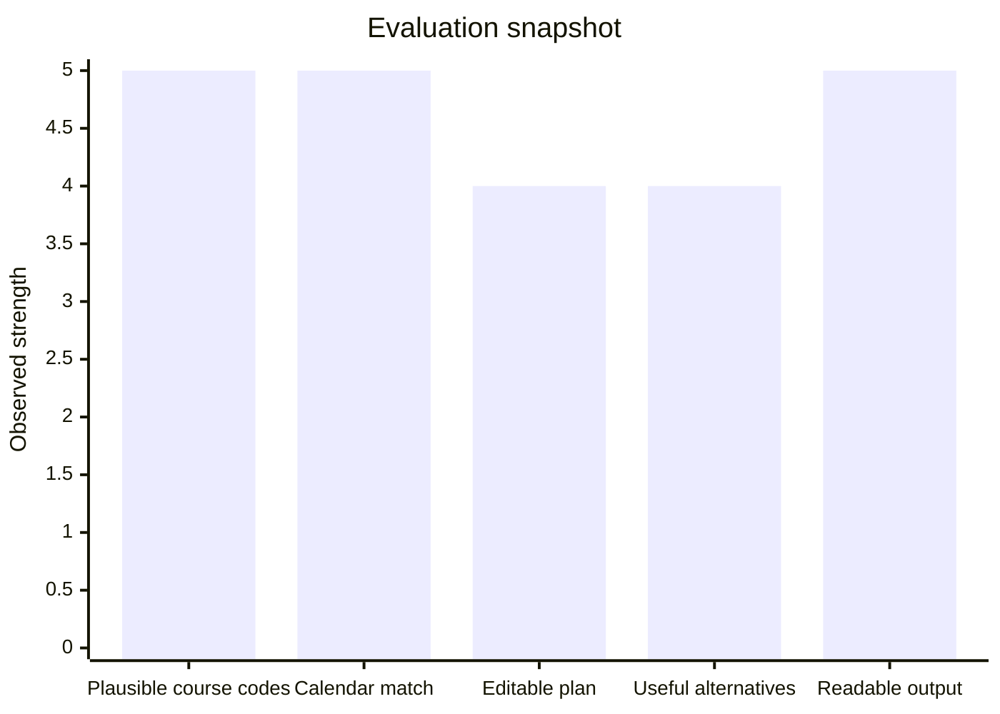

# GradFast ⚡
## AI-assisted graduation planning for students navigating complex degree systems

GradFast is an AI-assisted planning product that helps students turn messy graduation requirements into a concrete, editable academic roadmap. The product is aimed at a real and high-stakes bottleneck: students often make graduation decisions with incomplete information, inconsistent advising, and poor visibility into transfer credit rules, substitutions, sequencing constraints, and time-to-degree tradeoffs. In the worst cases, one missed rule costs an entire extra term.

For my project, I focused on a product question rather than a pure research question:

> Can a single AI-native interface help a student understand *how to graduate sooner* by generating a structured plan, exposing hidden levers like substitutions and transfer options, and supporting iterative changes through chat?

The result is **GradFast**, a local web product that generates a university-specific degree plan, lets the user modify that plan conversationally, and surfaces acceleration opportunities such as transfer credits, substitutions, and double-counting opportunities when available.

---

## Why this problem matters

Students with strong advising networks often graduate faster because they know where flexibility exists in the system. Students without that institutional knowledge usually do not. This problem is especially acute for:

- first-generation students
- transfer students
- international students
- students changing majors late
- students balancing cost, time, and immigration constraints
- students trying to combine BS/MS pathways or finish early

The insight behind GradFast is that graduation planning is not just “what classes do I take?” It is a constrained optimization problem mixed with hidden policy knowledge. Existing degree tools usually show a static audit; they do not help students explore alternative schedules, faster paths, or what-if scenarios in a flexible way.

---

## Product overview

GradFast currently has three main layers:

1. **Structured intake**
   - collects the student's university, major, standing, target graduation, and prior credits

2. **Plan generation**
   - produces a quarter-by-quarter or semester-by-semester plan with real-looking course codes, unit totals, and requirement groupings

3. **Interactive revision**
   - allows the student to ask for schedule changes in natural language and updates the plan accordingly

The product is designed to answer questions like:

- Can I still graduate early?
- What happens if I study abroad junior winter?
- Which requirements are hard constraints versus flexible electives?
- What courses could I transfer from a community college?
- What is the fastest realistic path if I already have prior credit?

---

## Core user flow


---

## System architecture



---

## What the product actually does

### 1. Intake
The system asks for:
- student name
- university
- major
- class year / standing
- target graduation timing
- prior credits

This is intentionally lightweight so the product can get to a useful result quickly.

### 2. Graduation plan generation
The LLM produces a structured plan with:
- term-by-term schedule
- course codes
- requirement categories
- unit counts
- alternatives and substitutes
- transfer options
- acceleration opportunities

### 3. Live advisor chat
The user can request plan changes in plain English, for example:
- “move CS106B to Spring 2026”
- “I want to study abroad Winter junior year”
- “Can I graduate one quarter earlier?”
- “What can I take at community college this summer?”

The chat does not directly mutate the schedule itself. Instead, the advisor returns structured information, and the frontend applies the move through deterministic logic.

### 4. Deterministic plan updates
A key technical design choice is that **course move logic runs in the frontend rather than trusting the LLM to rewrite the entire plan free-form**. This improves reliability and makes edits faster and more legible.

---

## Technical design

### Stack
| Layer | Technology |
|---|---|
| Frontend | React 18 + TypeScript + Vite |
| Styling | Tailwind CSS v4 + shadcn/ui |
| Routing | React Router v7 |
| LLM | GPT-4o-mini via OpenRouter |
| Plan generation | Single-shot JSON generation |
| Chat revisions | Stateful chat with full plan context |
| Interactive edits | Frontend `applyMove()` logic |

### Design choices
- **LLM for plan generation, not direct UI control**  
  The model generates structured planning outputs, but the interface preserves explicit control over plan mutations.

- **Frontend ownership of edits**  
  `applyMove()` performs the actual move operation after the model suggests a destination term. This reduces brittleness and makes interactions deterministic.

- **Structured JSON instead of free-form prose**  
  The UI is built around a data structure that can be rendered, re-colored, and edited rather than a long paragraph of advice.

---

## Example plan object

```json
{
  "terms": ["Fall 2025", "Winter 2026", "Spring 2026"],
  "courses": [
    {"code": "CS106A", "units": 5, "type": "hard"},
    {"code": "MATH51", "units": 5, "type": "hard"},
    {"code": "WAYS-EDUCATION", "units": 3, "type": "flexible"}
  ],
  "alternatives": [
    {"requirement": "statistics", "options": ["STATS116", "MS&E120"]}
  ],
  "transferOptions": [
    {"provider": "community college", "course": "Equivalent calculus option"}
  ],
  "loopholes": [
    "Potential double-counting opportunity subject to department approval"
  ]
}
```

---

## Evaluation

The rubric emphasizes evidence, testing, limitations, and communication, so I focused on demonstrating whether the product was actually producing plausible, useful plans rather than just looking polished. fileciteturn10file0

### Test profiles
I tested the system across five profiles:

| University | Major | Standing | Main check |
|---|---|---:|---|
| Stanford | Computer Science | Incoming first-year | quarter structure, 180-unit framing, recognizable CS course codes |
| MIT | Mathematics | Sophomore | semester structure, GIR-style framing |
| UC Berkeley | Economics | Junior | semester structure and breadth framing |
| American University | Political Science | First-year | AU Core structure and 120-credit framing |
| Carnegie Mellon | Computer Science | Sophomore | SCS-style required sequence framing |

### Validation questions
For each case, I checked:

- Does the output use plausible course codes for that institution?
- Does the plan respect the right academic calendar format?
- Do units / credits look directionally correct?
- Are hard requirements separated from flexible choices?
- Does the advisor chat preserve structure when the user requests a change?
- Are transfer suggestions and substitutions concrete rather than generic?

### Qualitative feedback
I also showed the product to a small set of students and used their reactions to test whether the plans felt legible and realistic. The most useful feedback was not “this is perfect,” but whether:
- the output looked like an actual degree path
- the change requests made sense
- the acceleration suggestions felt actionable

### Evaluation summary



### What worked best
- structured degree plans were easy to render and reason about
- course-move logic felt much more reliable once it was kept in the frontend
- the product was strongest when the user asked specific scheduling questions rather than vague life-planning questions

### Current limitations
- the system is not yet grounded in live registrar or audit data
- course codes can be plausible without being officially validated
- transfer recommendations still rely on model reasoning rather than a verified institutional database
- different universities encode requirements differently, so long-tail edge cases remain
- the product is not yet connected to a real transcript or degree-audit source

This limitation section matters because the project rubric explicitly values understanding limitations and making honest claims about success. fileciteturn10file0

---

## Why this is more than a demo wrapper

The main technical contribution is not just “I called an LLM.” It is the way the product is structured around:

- a constrained intake
- structured plan JSON
- deterministic frontend plan edits
- multiple output views over the same plan state
- acceleration-oriented reasoning rather than generic advising

That combination turns the product from a chatbot into a usable planning interface.

---

## Reproducibility

### Local setup

```bash
git clone https://github.com/nesibmu/GradFast.git
cd GradFast
npm install
```

Create a `.env` file:

```bash
VITE_OPENROUTER_API_KEY=sk-or-v1-your-key-here
```

Run locally:

```bash
npm run dev
```

The app opens at:

```bash
http://localhost:5173
```

### Core components
- intake form
- plan generation request
- planner grid
- advisor chat panel
- deterministic `applyMove()` edit logic

---

## Example product screenshots / assets to add

If you have screenshots before submission, add them under a `docs/` folder and replace the placeholders below.

```markdown


```

Until then, the Mermaid diagrams in this README give a rendered architecture and flow view directly on GitHub.

---

## Future work

The most valuable next steps are:

1. **Live catalog grounding**  
   pull official requirement pages or course catalogs so the plan is grounded in current source data

2. **Transfer credit memory**  
   build a dataset of successful transfer equivalents by school

3. **Degree audit import**  
   ingest transcript or audit data and mark completed requirements automatically

4. **Constraint-aware optimization**  
   explicitly optimize for shortest time-to-degree under unit caps, prerequisites, and availability constraints

5. **Petition assistance**  
   generate draft petitions for substitutions, waivers, or special approvals

---

## AI usage disclosure

The course requires honest disclosure of AI usage in the GitHub README, so this section is intentionally explicit. fileciteturn10file0

### During development
AI tools were used for:
- architecture brainstorming
- code iteration and debugging support
- UI ideation
- README drafting assistance

### At runtime
The product uses GPT-4o-mini through the OpenRouter API to generate graduation plans and advisor-style responses. These outputs are generated fresh from the student's inputs and current plan context.

### What I did myself
I defined the problem, chose the scope, designed the product framing, selected the architecture, decided to keep plan edits deterministic in the frontend, tested the system across multiple student profiles, and iterated on the final product positioning and evaluation story.

### Integrity note
This project should be understood as an AI-native product, not as a non-AI system with AI lightly attached. At the same time, the technical work lies in how the model is constrained, structured, and integrated into an interactive planning product rather than in simply exposing raw model output.

---

## Project track

**Application / Product**

This project fits the course’s application/product track: it is a concrete AI-native tool aimed at a real user problem, with an implemented interface, an operational workflow, and a clear path for iteration and deployment. fileciteturn10file0
