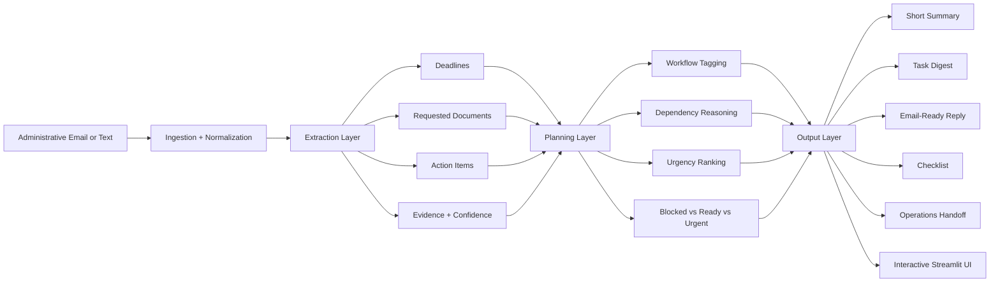
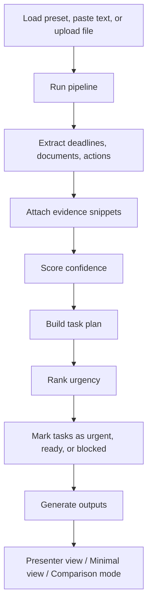
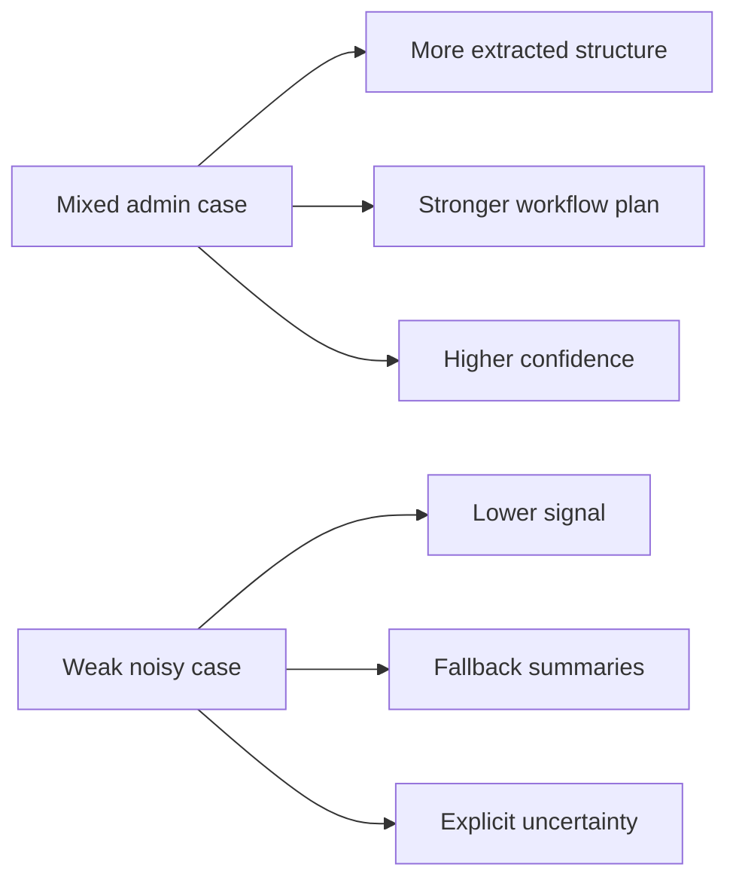

# VisaFlow

<div align="center">

**AI operations agent for international-student bureaucracy**

*Turn messy administrative emails into structured deadlines, document requests, task plans, and sendable outputs.*


</div>

---

## Overview

International students regularly receive high-stakes emails from housing offices, financial aid, registrars, and immigration offices. The problem is usually not just reading the message. The real bottleneck is turning a long, inconsistent administrative email into an actionable workflow:

- What exactly is being requested?
- What documents are needed?
- What is urgent?
- What can be done now versus later?
- What reply can be sent back quickly?

VisaFlow is a local prototype that converts those messages into structured operational support. Instead of leaving the user with a wall of text, it extracts deadlines, requested documents, and action items, maps them back to source evidence, builds a prioritized task plan, and generates reusable output artifacts such as a short summary, task digest, email-ready reply, checklist, and operations handoff.

---

## Why I built this

Administrative workflows are one of the most frustrating forms of modern bureaucracy because they are repetitive, time-sensitive, and easy to mis-handle. For international students, these messages often affect housing, funding, enrollment, travel status, and immigration compliance. A missed line in one email can create outsized downstream costs.

I built VisaFlow to explore whether a small, explainable AI workflow layer could reduce that cognitive overhead. My goal was not to build a generic chatbot. It was to build a focused operations agent that helps a user convert an administrative message into a concrete action plan.

---

## What the product does

VisaFlow currently supports:

- deadline extraction
- requested document extraction
- action item extraction
- evidence snippet selection
- confidence scoring
- workflow tagging
- blocked task explanations
- urgency ranking
- exportable workflow artifacts

### Artifact suite

| Artifact | Purpose |
|---|---|
| Short Summary | Fast screenshot-friendly view of the case |
| Task Digest | Compact task-only operational handoff |
| Full Summary | Richer explanation of the current workflow |
| Email-Ready Reply | Cleaner response draft that is close to sendable |
| Baseline Draft | Simpler draft for comparison |
| Enhanced Draft | More detailed response artifact |
| Checklist | Execution-oriented step list |
| Operations Handoff | Full structured handoff artifact |

---

## System architecture



---

## End-to-end workflow



---

## Product views and demo modes

VisaFlow includes several presentation modes so the same system can be shown at different levels of depth.

| Mode | What it is for |
|---|---|
| Presenter Mode | Clean demo flow with the strongest outputs surfaced first |
| Minimal View | Presentation-friendly layout with less visual clutter |
| Comparison Mode | Side-by-side comparison of a strong case and a weak/noisy case |
| Quick Launch Presets | One-click demo presets for fast walkthroughs |
| Guided Demo Panels | Demo checklist, preset notes, and comparison guidance |

---

## Main presets

| Preset | What it demonstrates |
|---|---|
| Mixed admin case | Strongest overall demo, showing cross-workflow extraction and planning |
| Escalated admin case | Denser case with multiple deadlines and heavier document load |
| Housing follow-up | Cleaner single-theme walkthrough |
| Financial aid review | Sentence-based extraction from natural email text |
| Immigration update | Immigration-specific workflow tagging |
| Weak noisy case | Graceful fallback handling on incomplete input |

---

## Demo comparison view



This comparison is useful because it shows both capability and restraint: the system does more when the input is rich, and it becomes more cautious when the input is vague.

---

## Evaluation and evidence

This project is a product prototype, so evaluation here focuses on whether the system is understandable, functional, and honest about its limits.

### What I used as evidence

- lightweight test coverage across extraction, workflow tagging, weak-input handling, task digest integration, export consistency, and README alignment
- comparison between stronger and weaker preset cases
- explicit fallback behavior for incomplete or noisy input
- evidence panels that connect extracted items back to source snippets
- visible commit history showing iteration over time

### What success looks like in this prototype

- the app consistently turns a messy admin message into a clearer plan
- extracted requirements are easier to scan than the raw message
- outputs are useful in different contexts: quick update, execution, or reply drafting
- the system handles weak inputs without pretending to know more than it does

### Known limitations

- extraction is still mostly pattern- and rule-based rather than model-based
- the current version is optimized for local demo use, not deployment
- there is no live email integration, authentication layer, or production data pipeline
- confidence is heuristic, not calibrated with a labeled benchmark set
- evaluation is based on targeted cases and tests, not a large external dataset

---

## Example use cases

- **Housing:** identify contract requests, agreements, portal instructions, and deadlines
- **Financial aid:** identify bank statements, statements of support, and reply obligations
- **Immigration:** identify passport and I-20 requests, plus confirmation steps
- **Mixed administrative cases:** unify multiple requirements into one plan instead of leaving the user to manually separate them

---

## Why this is an AI operations project

This project fits the **Automation / Agent Systems** track because the goal is not just classification or summarization. The goal is to turn unstructured operational input into a sequence of concrete next steps and reusable artifacts.

VisaFlow acts like a narrow operations layer:

1. read the message
2. extract what matters
3. reason about urgency and dependencies
4. generate outputs that help the user execute

---

## Reproducibility

### Run locally

Install dependencies:

```bash
python -m pip install -r requirements.txt
```

Run the app:

```bash
python -m streamlit run app.py
```

### Repository structure

- `app.py` — main Streamlit app
- `visaflow/extraction/` — extraction, normalization, evidence selection
- `visaflow/planning/` — workflow planning, dependencies, urgency ordering
- `visaflow/drafting/` — summaries, task digest, drafts, checklist, handoff outputs
- `visaflow/ingestion/` — input loading
- `data/samples/` — demo sample inputs
- `tests/` — lightweight tests used during iteration

---

## Development process

A major part of the project was iterative refinement rather than one-shot implementation. The system evolved from a basic extraction pipeline into a more polished product with:

- confidence and evidence views
- richer planning logic
- multiple export artifacts
- presenter-oriented demo support
- better weak-input handling
- improved comparison flows

That iteration is reflected in the public commit history and the growing set of tests and outputs.

---

## AI usage disclosure

AI tools were used during development, and this project is disclosed accordingly.

### How AI tools were used

- brainstorming implementation options and UI ideas
- accelerating code scaffolding for parts of the Streamlit interface
- debugging specific integration issues and patching errors
- suggesting test cases and cleanup passes
- helping rewrite documentation and artifact copy more clearly

### What remained my responsibility

- choosing the project direction and scope
- deciding the product framing and target problem
- selecting which features stayed or were removed
- iterating on the demo flow and preset strategy
- reviewing, adapting, and integrating the code into the actual repository
- making final decisions about outputs, limitations, and how the project should be presented

I did **not** treat AI output as automatically correct. The project required repeated integration, debugging, refinement, and manual judgment to get the current prototype into a coherent final state.

---

## Final project state

This repository is the frozen local demo version of VisaFlow. It is designed to show how administrative communication can be converted into structured operational support with clearer extraction, more useful workflow planning, and presentation-ready artifacts.

The current version is optimized for:

- local demonstration
- preset-driven walkthroughs
- comparison of strong and weak cases
- exportable workflow artifacts
- readable documentation for reproducibility

It is not intended to be a deployed production system.
